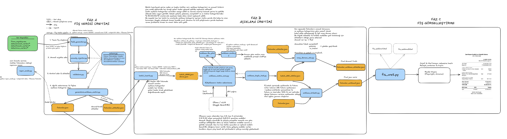
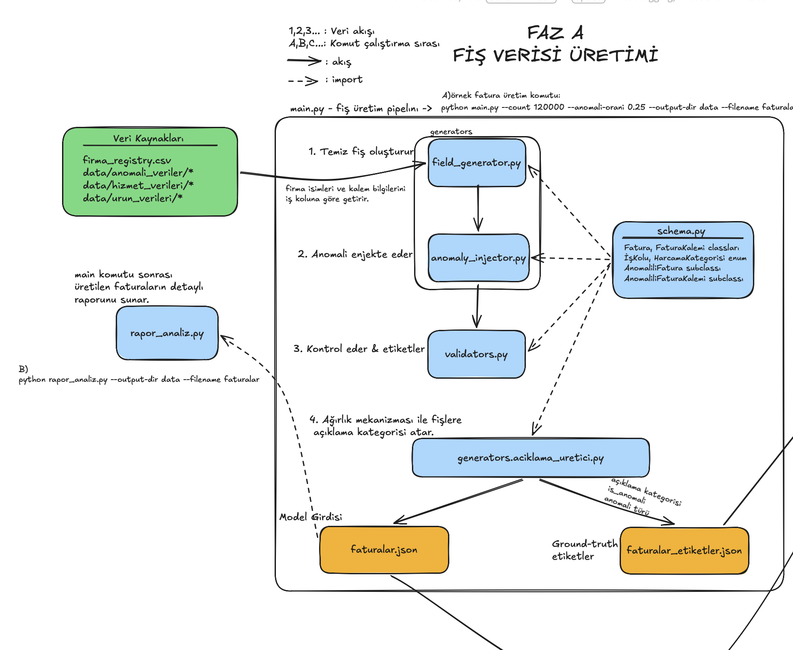
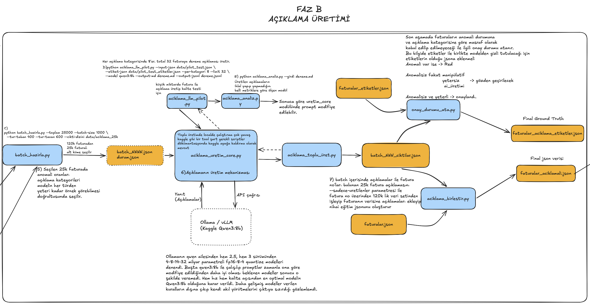
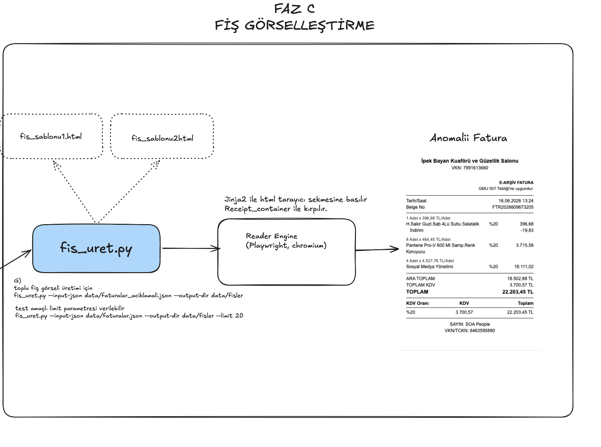

# masrafAI — Sentetik Masraf Fişi ve Sahtecilik Veri Seti Üretimi

Masraf ve fatura sahteciliği tespiti için **sentetik Türkçe veri seti** üreten
bir araç zinciri. Gerçek veriye erişim gerektirmeden; gerçekçi fişler, bu
fişlere çalışanın yazdığı açıklama metinleri ve bunların doğru etiketlerini
birlikte üretir.

Kurgulanan senaryo şu: bir şirket çalışanı yaptığı harcamanın fişini masraf
uygulamasına yükler ve harcamanın bağlamını anlatan kısa bir açıklama yazar.
Muhasebe bu ikisine bakarak masrafı onaylar, reddeder ya da incelemeye alır.
Veri seti bu üçlüyü de üretir.

## Ne üretiyor?

| çıktı | içerik |
| --- | --- |
| `faturalar_aciklamali.json` | **Model girdisi** — fatura alanları + `aciklama_metni` |
| `faturalar_aciklamali_etiketler.json` | **Ground truth** — `is_anomali`, `anomali_turleri`, `aciklama_kategorisi`, `onay_durumu` |
| `data/fisler/<kayit_id>.png` | Fişin görsel hâli (görü tabanlı modeller için) |

İki JSON dosyası `kayit_id` ile satır satır eşleşir.

**En önemli ilke:** modelin görmesi gereken alanlar ile ground-truth etiketler
asla aynı dosyada bulunmaz. Bu ayrım bozulursa model gerçekte öğrenmediği bir
başarıyı gösterir.



---

## Faz A — Fatura verisi üretimi

Gerçekçi fatura kalemleri, firmalar ve tutarlar üretir; içine kontrollü
**anomaliler** enjekte eder; bağımsız bir doğrulayıcıyla kural ihlallerini
tespit edip etiketler.



```bash
python -m faz_a.main --count 120000 --anomali-orani 0.25 --output-dir data --filename faturalar
python -m faz_a.rapor_analiz --output-dir data --filename faturalar   # üretim sonrası teşhis
```

| parametre | açıklama |
| --- | --- |
| `--count` | Üretilecek fatura sayısı |
| `--anomali-orani` | Anomalili fatura oranı (0.25 = %25) |
| `--output-dir` | Çıktı klasörü |
| `--filename` | Dosya adı öneki |

**14 anomali türü** üç eksende toplanır:

- *Aritmetik / belge*: ara toplam, satır toplamı, KDV tutarı, genel toplam,
  footer, ondalık kayması, düşük ondalık kayması
- *Kimlik / tarih / tekrar*: geçersiz kimlik no, gelecek tarihli, mükerrer fiş
  yükleme, fatura no çakışması
- *Politika / makullük*: yasaklı kategori, limit aşımı, iş kolu–kategori
  uyumsuzluğu

Etiketleme **union** mantığıyla çalışır: enjekte edilen tür ile bağımsız
doğrulayıcının bulduğu türlerin birleşimi yazılır, çünkü bir anomali enjekte
edilirken yan etkiyle başka bir kural da ihlal edilebilir.

Satıcı kimliği tek kalıcı kaynaktan gelir: `data/firma_registry.csv`. Bu dosya
OpenStreetMap'ten çekilmiş gerçek işletme adlarını, sentetik dolguyu ve şahıs
şirketi havuzunu harmanlar. Bir kez üretilir:

```bash
python -m faz_a.firma_adlari_osm_cek --yeniden --hedef 3000 --bekleme 10
python -m faz_a.firma_registry_olustur --hedef-per-iskolu 1500 --osm-pay 0.8 --seed 42
```

---

## Faz B — Açıklama üretimi

Her faturaya, çalışanın yazmış olacağı kısa açıklama metnini bir dil modeliyle
üretir. Metin rastgele değildir: her faturaya Faz A'da bir **kalite kategorisi**
atanmıştır ve model o kategoriye sadık bir metin yazmak zorundadır.



| kategori | ne demek | oran |
| --- | --- | --- |
| `yeterli` | Kurumsal amacı ve kalemi açıkça anlatır | %50 |
| `yetersiz` | Anlamlı bilgi taşımaz ("Masraf.") | %20 |
| `manipulatif` | Gerçeği gizler, kılıf uydurur, ısrar eder | %20 |
| `ai_uretimi` | Yapay zekâ tarafından yazılmış izlenimi verir | %10 |

```bash
# 1. Dengeli alt küme seç ve batch'lere böl
python -m faz_b.batch_hazirla --toplam 25000 --batch-size 1000 \
    --tur-taban 400 --tur-tavan 600 --cikti-dizini data/aciklama_25k

# 2. Üret (kesintiye dayanıklı; aynı komut kaldığı yerden devam eder)
python -m faz_b.aciklama_toplu_uret --cikti-dizini data/aciklama_25k \
    --saglayici ollama --workers 2 --ilerleme 1000

# 3. Derle
python -m faz_b.aciklama_birlestir --cikti-dizini data/aciklama_25k --sadece-uretilenler
python -m faz_b.onay_durumu_ata    --cikti-dizini data/aciklama_25k
```

Alt küme seçimi **rastgele değildir**: bazı anomali türleri havuzda birkaç yüz
kayıtken bazıları binlercedir. Tür başına taban/tavan kotası uygulanarak nadir
türlerin de yeterli örnekle temsil edilmesi sağlanır.

**Sağlayıcılar:** `--saglayici ollama | vllm | groq`. Yerel geliştirme için
Ollama, ücretsiz GPU üzerinde toplu üretim için Kaggle + vLLM (Qwen3-8B).

Üretilen metin kural tabanlı denetimden geçer; ihlal bulunursa metin bir kez
düzeltme notuyla yeniden istenir.

---

## Faz C — Fiş görselleştirme

Fatura verisinden gerçek bir fişe benzeyen PNG üretir. Faz B'ye bağlı değildir;
Faz A biter bitmez çalıştırılabilir.



```bash
python -m faz_c.fis_uret --input-json data/faturalar.json --output-dir data/fisler
```

İki farklı şablon (yazarkasa fişi ve e-arşiv fatura) arasında, faturanın
`kayit_id`'sinden **deterministik** olarak seçim yapılır — tek tip görsel
üretilirse model fişi okumayı değil tek bir düzeni ezberler. Seçim etiketlerle
korelasyonsuzdur.

Fişin **kendi içinde tutarlı** olması kritiktir: satırların toplamı fatura
toplamına eşit çıkmalı, aksi hâlde enjekte edilen gerçek tutarsızlıklar kendi
ürettiğimiz gürültünün içinde kaybolur. Yaklaşık 93 ms/fiş.

---

## Kurulum

```bash
git clone https://github.com/Demokann/Sentetik-Fi-retimi.git
cd Sentetik-Fi-retimi

python -m venv venv && source venv/bin/activate   # Windows: venv\Scripts\activate
pip install -r requirements.txt

playwright install chromium    # yalnızca Faz C için
```

Faz B'yi yerelde çalıştırmak için [Ollama](https://ollama.com) kurulu olmalı:

```bash
ollama pull qwen3:8b
OLLAMA_NUM_PARALLEL=2 OLLAMA_FLASH_ATTENTION=1 ollama serve
```

## Depo yapısı

```
main.py                   Faz A orkestratörü
schema.py                 Pydantic modelleri, enum'lar, politika sabitleri
validators.py             Bağımsız doğrulama ve union etiketleme
generators/
  field_generator.py      Kalem, firma, tutar üretimi
  anomaly_injector.py     Anomali enjeksiyonu
  aciklama_uretici.py     Açıklama kalite kategorisi ataması

batch_hazirla.py          Faz B alt küme seçimi ve batch'leme
aciklama_uretim_core.py   Prompt kurulumu, LLM çağrısı, denetim, retry
aciklama_toplu_uret.py    Toplu üretim runner'ı (resumable)
aciklama_birlestir.py     Metinleri faturalara birleştirir
onay_durumu_ata.py        onay_durumu ground-truth etiketi
aciklama_llm_pilot.py     Küçük örneklemle kalite testi
aciklama_analiz.py        Çeşitlilik ve ihlal ölçümü

fis_uret.py               Faz C — fiş görseli üretimi
fis_sablon_1.html         Yazarkasa fişi şablonu
fis_sablon_2.html         e-Arşiv fatura şablonu

data/                     Üretilen veri ve ham havuzlar (repoya girmez)
docs/                     Faz bazlı ayrıntılı dokümantasyon
```

## Notlar

- **`kayit_id`** boru hattının benzersiz anahtarıdır. `fatura_no` kullanılmaz,
  çünkü veri setinde aynı fatura numarasına sahip iki kayıt **bilerek** bulunur
  (mükerrer fiş yükleme ve fatura no çakışması anomalileri). `kayit_id` eğitimde
  özellik olarak kullanılmamalıdır.
- Üretilen veri (`data/`) repoya dahil değildir; yukarıdaki komutlarla yeniden
  üretilir.
- Kod ve iletişim dili Türkçe: değişken adları, yorumlar ve dokümanlar Türkçe
  yazılır.
- Ayrıntılı dokümantasyon `docs/` altındadır: her fazın tasarım kararları,
  ölçümleri ve tuzakları.
